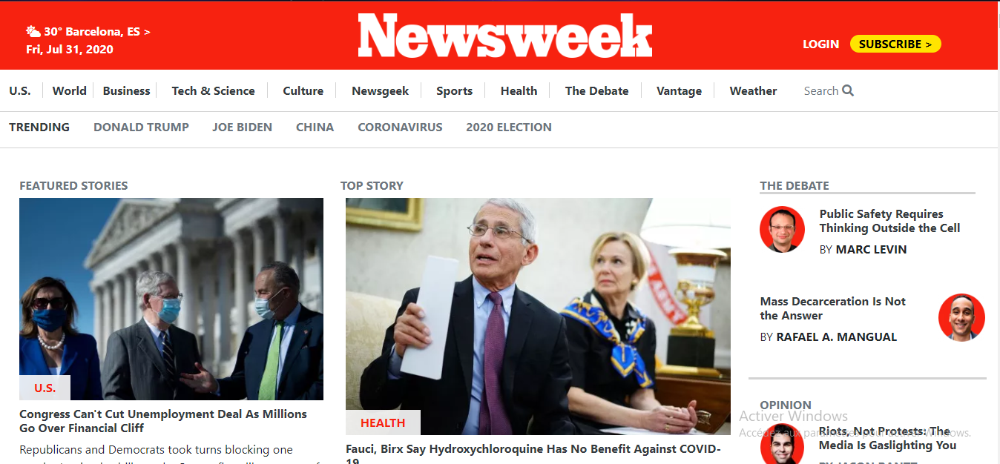

# newsweek

> Working with Bootstrap

This project was built with the bootstrap framework and it had as major objective to test our mastery of bootstrap and how to use it effectively and correctly so as to built future web pages.

## Built With

-   HTML,
-   CSS
-   BOOTSTRAP

## Live Demo

[Live Demo Link](https://raw.githack.com/emmanuellekamwa/newsweek/tree/feature-branch)

## Author

👤 **Emmanuelle Kamwa**

-   Github: [@emmanuellekamwa](https://github.com/emmanuellekamwa)
-   Twitter: [@AlixKamwa](https://twitter.com/AlixKamwa)
-   Linkedin: [emmanuelle-kamwa-86145a1a4](https://www.linkedin.com/in/emmanuelle-kamwa-86145a1a4/)

# Show Some Support

Give a ⭐ if you've liked my project and your comments are highly accepted.
